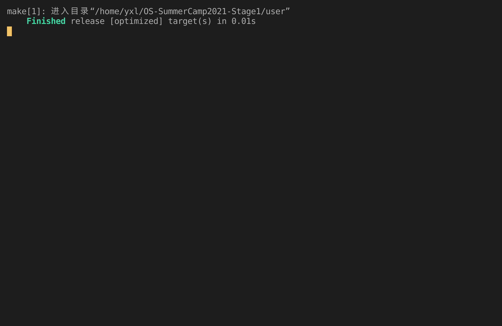
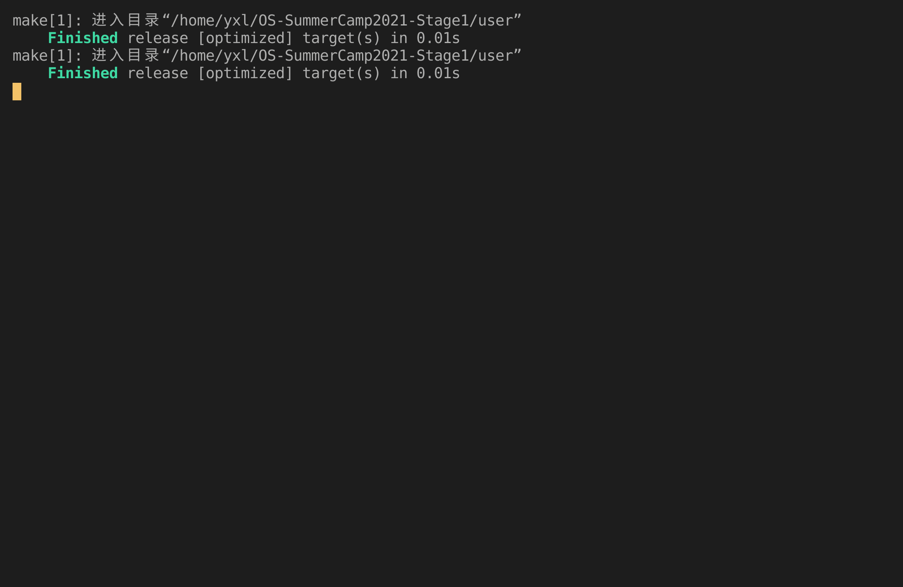

# Lab2 Report

## 实验内容

- 实现 `sys_write` 和 `sys_exit` 系统调用。
- 为 `sys_write` 增加安全性检查。

## 运行截图

_2_

_2_bad_

## 问答作业

1. 正确进入 U 态后，程序的特征还应有：使用 S 态特权指令，访问 S 态寄存器后会报错。目前由于一些其他原因，这些问题不太好测试，请同学们可以自行测试这些内容（参考[前三个测例](https://github.com/DeathWish5/rCore_tutorial_tests/tree/master/user/src/bin)），描述程序出错行为，同时注意注明你使用的 sbi 及其版本。
2. 请结合用例理解 [trap.S](https://github.com/rcore-os/rCore-Tutorial-v3/blob/ch2/os/src/trap/trap.S) 中两个函数 `__alltraps` 和 `__restore` 的作用，并回答如下几个问题:
   1. L40：刚进入 `__restore` 时，`a0` 代表了什么值。请指出 `__restore` 的两种使用情景。
   2. L46-L51：这几行汇编代码特殊处理了哪些寄存器？这些寄存器的的值对于进入用户态有何意义？请分别解释。
   3. L53-L59：为何跳过了 `x2` 和 `x4`？
   4. L63：该指令之后，`sp` 和 `sscratch` 中的值分别有什么意义？
   5. `__restore`：中发生状态切换在哪一条指令？为何该指令执行之后会进入用户态？
   6. L13：该指令之后，`sp` 和 `sscratch` 中的值分别有什么意义？
   7. 从 U 态进入 S 态是哪一条指令发生的？
3. 程序陷入内核的原因有中断和异常（系统调用），请问 riscv64 支持哪些中断 / 异常？如何判断进入内核是由于中断还是异常？描述陷入内核时的几个重要寄存器及其值。
4. 对于任何中断，`__alltraps` 中都需要保存所有寄存器吗？你有没有想到一些加速 `__alltraps` 的方法？简单描述你的想法。
