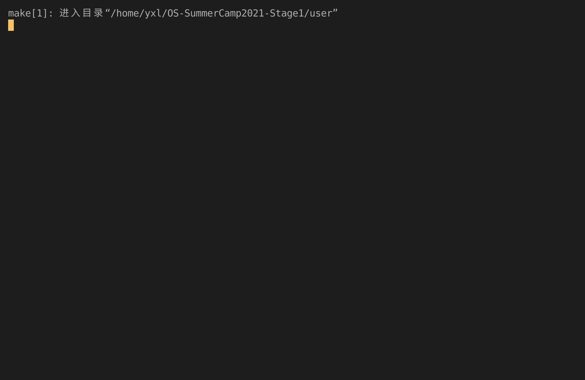

# Lab2 Report

## 实验内容

- 实现 `sys_yield` 系统调用。
- 实现协作式和抢占式的调度。
- 实现 `sys_get_time` 和 `sys_set_priority` 系统调用。
- 实现 stide 调度算法。
- 实现人为限制程序执行的最大时间（5s）。

## 运行截图

_3_0_

_3_1_

_3_2_

## 问答作业

1. 简要描述这一章的进程调度策略。何时进行进程切换？如何选择下一个运行的进程？如何处理新加入的进程？
2. 在 C 版代码中，同样实现了类似 RR 的调度算法，但是由于没有 VecDeque 这样直接可用的数据结构（Rust 很棒对不对），C 版代码的实现严格来讲存在一定问题。大致情况如下：C 版代码使用一个进程池（也就是一个 struct proc 的数组）管理进程调度，当一个时间片用尽后，选择下一个进程逻辑在 [chapter3 相关代码](https://github.com/DeathWish5/ucore-Tutorial/blob/ch3/kernel/proc.c#L60-L74) ，也就是当第 i 号进程结束后，会以 i -> max_num -> 0 -> i 的顺序遍历进程池，直到找到下一个就绪进程。C 版代码新进程在调度池中的位置选择见 [chapter5 相关代码](https://github.com/DeathWish5/ucore-Tutorial/blob/ch5/kernel/proc.c#L90-L98) ，也就是从头到尾遍历进程池，找到第一个空位。
   1. 在目前这一章（chapter3）两种调度策略有实质不同吗？考虑在一个完整的 os 中，随时可能有新进程产生，这两种策略是否实质相同？
   2. 其实 C 版调度策略在公平性上存在比较大的问题，请找到一个进程产生和结束的时间序列，使得在该调度算法下发生：先创建的进程后执行的现象。你需要给出类似下面例子的信息（有更详细的分析描述更好，但尽量精简）。同时指出该序列在你实现的 stride 调度算法下顺序是怎样的？
3. stride 算法深入

   stride 算法原理非常简单，但是有一个比较大的问题。例如两个 pass = 10 的进程，使用 8bit 无符号整形储存 stride， p1.stride = 255, p2.stride = 250，在 p2 执行一个时间片后，理论上下一次应该 p1 执行。

   - 实际情况是轮到 p1 执行吗？为什么？

     我们之前要求进程优先级 >= 2 其实就是为了解决这个问题。可以证明，在不考虑溢出的情况下, 在进程优先级全部 >= 2 的情况下，如果严格按照算法执行，那么 STRIDE_MAX – STRIDE_MIN <= BigStride / 2。

   - 为什么？尝试简单说明（传达思想即可，不要求严格证明）。

     已知以上结论，考虑溢出的情况下，我们可以通过设计 Stride 的比较接口，结合 BinaryHeap 的 pop 接口可以很容易的找到真正最小的 Stride。

   - 请补全如下 partial_cmp 函数（假设永远不会相等）。

     例如使用 8 bits 存储 stride, BigStride = 255, 则:

     - (125 < 255) == false
     - (129 < 255) == true
