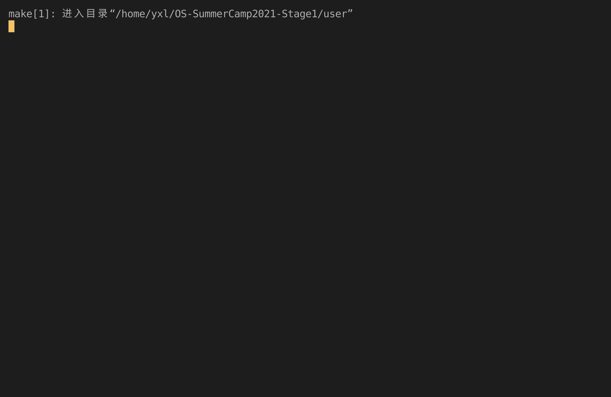

# Lab4 Report

## 实验内容

- 实现虚拟内存。
- 实现 `sys_mmap` 和 `sys_munmap` 系统调用。
- 更新 `sys_write` 的范围检查。

## 运行截图

_4_only_

## 问答作业

1. 请列举 SV39 页表页表项的组成，结合课堂内容，描述其中的标志位有何作用／潜在作用？

   **答**：

   |  63~54   | 53~28  | 27~19  | 18~10  | 9~8 |  7  |  6  |  5  |  4  |  3  |  2  |  1  |  0  |
   | :------: | :----: | :----: | :----: | :-: | :-: | :-: | :-: | :-: | :-: | :-: | :-: | :-: |
   | Reserved | PPN[2] | PPN[1] | PPN[0] | RSW |  D  |  A  |  G  |  U  |  X  |  W  |  R  |  V  |
   |    10    |   26   |   9    |   9    |  2  |  1  |  1  |  1  |  1  |  1  |  1  |  1  |  1  |

   - V(Valid)：指示页表项是否有效；
   - R(readable)/W(writable)/X(executable)：

     |  X  |  W  |  R  | 含义                 |
     | :-: | :-: | :-: | :------------------- |
     |  0  |  0  |  0  | 指向下一级页表的指针 |
     |  0  |  0  |  1  | 只读                 |
     |  0  |  1  |  0  | _保留_               |
     |  0  |  1  |  1  | 读写                 |
     |  1  |  0  |  0  | 只执行               |
     |  1  |  0  |  1  | 读执行               |
     |  1  |  1  |  0  | _保留_               |
     |  1  |  1  |  1  | 读写执行             |

   - U(User mode)：指示用户模式是否可以访问该页面；
   - G(Global)：指定全局映射；
   - A(Accessed)：表示自上次被清除以来，页表项的对应虚拟页表是否被访问过；
   - D(Dirty)：表示自上次被清除以来，页表项的对应虚拟页表是否被修改过。

2. 缺页

   1. 请问哪些异常可能是缺页导致的？

      **答**：instruction page fault，load page fault，store page fault。

   2. 发生缺页时，描述相关的重要寄存器的值。

      **答**：`scause`：12/13/15。

   3. 这样做有哪些好处？

      **答**：减少开销，提高速度。

   4. 请问处理 10G 连续的内存页面，需要操作的页表实际大致占用多少内存（给出数量级即可）？

      **答**：20MiB。

   5. 请简单思考如何才能在现有框架基础上实现 Lazy 策略，缺页时又如何处理？描述合理即可，不需要考虑实现。

      **答**：将申请内存的操作缓存起来，等到访问的时候再实际申请。

   6. 此时页面失效如何表现在页表项（PTE）上？

      **答**：标志位 V 为 0。

3. 双页表与单页表

   1. 如何更换页表？

      **答**：设置 satp，并执行 `sfence.vma`。

   2. 单页表情况下，如何控制用户态无法访问内核页面？

      **答**：标志位 U。

   3. 单页表有何优势？

      **答**：更换页表少。

   4. 双页表实现下，何时需要更换页表？假设你写一个单页表操作系统，你会选择何时更换页表？

      **答**：特权级转换时。
