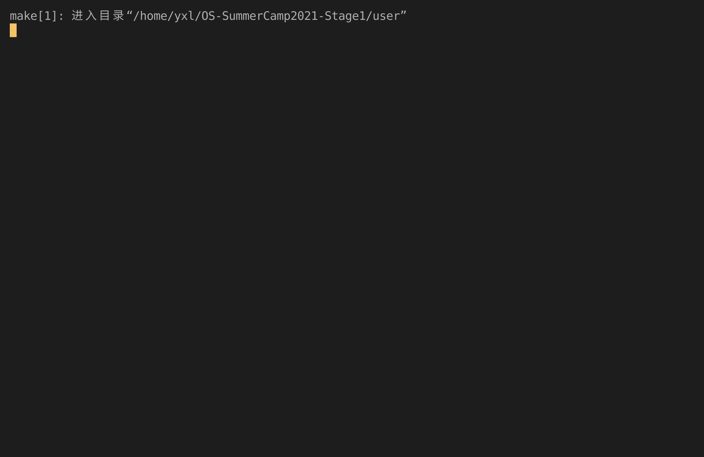

# Lab5 Report

## 实验内容

- 实现 `sys_getpid`、`sys_fork`、`sys_exec`、`sys_waitpid` 系统调用，实现进程控制。
- 实现 `sys_read` 系统调用，可以运行 usershell。
- 实现 `sys_spawn` 系统调用。

## 运行截图


_5_


_5_only_


_usershell_

## 问答作业

1. fork + exec 的一个比较大的问题是 fork 之后的内存页/文件等资源完全没有使用就废弃了，针对这一点，有什么改进策略？

   **答**：使用写时复制（Copy-on-write，COW），只有当父子之间开始出现差异时，才会对内存页进行复制。

2. 其实使用了题(1)的策略之后，fork + exec 所带来的无效资源的问题已经基本被解决了，但是今年来 fork 还是在被不断的批判，那么到底是什么正在“杀死”fork？可以参考[论文](https://www.microsoft.com/en-us/research/uploads/prod/2019/04/fork-hotos19.pdf) 。

   **答**：① 安全性：子进程继承了父进程的数据，需要手动删除不需要的数据内容，这带来了安全性问题；② 多进程：创建子进程的开销过大阻碍了多进程的使用。

3. fork 当年被设计并称道肯定是有其好处的。请使用**带初始参数**的 spawn 重写如下 fork 程序，然后描述 fork 有那些好处。注意:使用“伪代码”传达意思即可，spawn 接口可以自定义。可以写多个文件。

   **答**：

   ```rust
   // parent.rs
   fn main() {
       let a = get_a();
       spawn("children.rs", a);
       println!("a = {}", a);
       0
   }
   ```

   ```rust
   // children.rs
   fn main() {
       let [a] = args();
       let b = get_b();
       println!("a + b = {}", a + b);
       0;
   }
   ```

4. 描述进程执行的几种状态，以及 fork/exec/wait/exit 对于状态的影响。

   **答**：进程执行状态有 Ready，Running，Zombie。fork 后为 Ready，exec 后为 Running，wait 和 exit 后为 Zombie。
