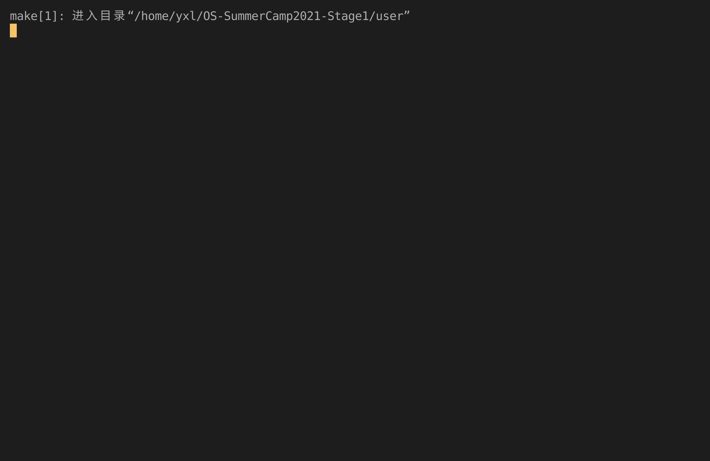

# Lab6 Report

## 实验内容

- 实现 `sys_close`、`sys_pipe`、`sys_read`、`sys_write` 系统调用，可以基于 pipe 进行进程通信。
- 实现 `sys_mail_read` 和 `sys_mail_write` 系统调用，可以基于邮箱机制进行进程通信。

## 运行截图

_6_

_6_only_

## 问答作业

1. 举出使用 pipe 的一个实际应用的例子。

   **答**：UI 应用遇到大计算量问题时，可以在子进程中进行运算，将结果通过 pipe 传到主进程，这样可以防止交互过程被阻塞。

2. 假设我们的邮箱现在有了更加强大的功能，容量大幅增加而且记录邮件来源，可以实现“回信”。考虑一个多核场景，有 m 个核为消费者，n 个为生产者，消费者通过邮箱向生产者提出订单，生产者通过邮箱回信给出产品。

   1. 假设你的邮箱实现没有使用锁等机制进行保护，在多核情景下可能会发生哪些问题？单核一定不会发生问题吗？为什么？

      **答**：两个消费者同时提出订单，当容量只剩 1 时会发生竞争。单核情景下分时系统也可能发生。

   2. 请结合你在课堂上学到的内容，描述读者写者问题的经典解决方案，必要时提供伪代码。

      **答**：上锁。

   3. 由于读写是基于报文的，不是随机读写，你有什么点子来优化邮箱的实现吗？

      **答**：固定地址，共用内存。
